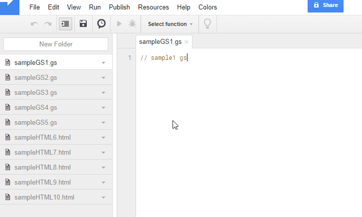

ProjectApp
=====

# Overview
This is a GAS project library for Google Apps Script (GAS).

## Note :
**If you want to use a library which can be used for the projects of both standalone script type and container-bound script type, please use [ProjectApp2](https://github.com/tanaikech/ProjectApp2).**

# Demo

In this demonstration, all scripts in a project are retrieved using ``getProjectBlob()``.

# Description
There are Class SpreadsheetApp and Class DocumentApp for operating spreadsheet and document, respectively. But there is no Class for operating GAS project. If there is such Class ProjectApp, GAS project can be directly operated by GAS script. I thought that this will lead to new applications, and created ProjectApp.

On the other hand, as a CLI tool for operating GAS project, there has already been [ggsrun](https://github.com/tanaikech/ggsrun).

## Features
1. **You can use ProjectApp by freely selecting one of 2 methods for authorization.**
    1. Use Manifests.
    1. Use OAuth2 process.
1. **Retrieve scripts in a project as Blob and JSON.**
    - For Blob, you can retrieve each script in a project.
    - About this, scripts can be retrieved not only from [standalone scripts](https://developers.google.com/apps-script/guides/standalone), but also from [container-bound Scripts](https://developers.google.com/apps-script/guides/bound).
1. **Create a project from Blob and JSON.**
    - For Blob, you can create new project from a file or several files on Google Drive.
    - Standalone scripts can be created. But container-bound Scripts cannot be created.
1. **Update a project from Blob and JSON.**
    - For Blob, you can update the project using a file or several files on Google Drive.
    - Standalone scripts can be updated. But container-bound Scripts cannot be updated.

# Library's project key
~~~
1l_XfWeEKp-g45lI-ikQ1KFrHX9YWlR2rWpaVMVs8miaa3J6PUYQqDo5C
~~~

# How to install
**This installation document is a simple. If you want to see the detail of installation, please click each link.**

1. [Install Library to Use ProjectApp](help/README.md#InstallLibrarytoUseProjectApp)
    - Library's project key is **``1l_XfWeEKp-g45lI-ikQ1KFrHX9YWlR2rWpaVMVs8miaa3J6PUYQqDo5C``**.
1. [Enable Drive API at API console](https://console.developers.google.com/apis/api/drive/overview)
    - On script editor
    - Resources -> Cloud Platform project
    - View API console
    - At Getting started, click Enable APIs and get credentials like keys.
    - At left side, click Library.
    - At Search for APIs & services, input **Drive API**. And click Google Drive API.
    - Click Enable button.
        - If it has already been enabled, please don't turn off.

<u>Installing is done! You can use ProjectApp.</u>

[In the case of an error related to scopes, please check here.](#QA)

## About scopes
About the install of scopes used at this library, users are not required to install scopes. Becasuse this library can automatically install the required scopes to the project which installed this library. The detail information about this can be seen at [here](https://gist.github.com/tanaikech/23ddf599a4155b66f1029978bba8153b).

# Usage
| Method | Return | Description |
|:------|:------|:------|
| getProjectBlob(projectId, zip) | Blob[] | Retrieve scripts from a project as Blob[]. **Each blob means each script in a project.** Scripts are returned as an array like ``[blob, blob, blob, ...]``. The blob can be seen using [``getDataAsString()``](https://developers.google.com/apps-script/reference/base/blob#getDataAsString()) and [``DriveApp.createFile(blob)``](https://developers.google.com/apps-script/reference/drive/drive-app#createFile(BlobSource)). ``zip`` is a boolean. If ``zip`` is true, scripts are returned as blob of a zip file. |
| createProjectByBlob(projectname, blob, folderId) | Object | Create a project from Blob[]. **Each blob means each script in a project.** So if you have a script which is a file of sample.gs, you can use as a blob using ``DriveApp.getFileById("### file id of sample.gs ###").getBlob()``. |
| updateProjectByBlob(projectId, blob) | Object | Update existing project using Blob[]. **Each blob means each script in a project.** So if you have a script which is a file of sample.gs, you can use as a blob using ``DriveApp.getFileById("### file id of sample.gs ###").getBlob()``. |
| getProjectRaw(projectId) | Object[] | Retrieve scripts from a project as Object[]. The structure of Object[] is [here](https://developers.google.com/apps-script/guides/import-export#export_projects_from_drive). |
| createProjectByRaw(projectname, raw, folderId) | Object | Create a project from Object[]. The structure of Object[] is [here](https://developers.google.com/apps-script/guides/import-export#export_projects_from_drive). |
| updateProjectByRaw(projectId, raw) | Object | Update existing project using Object[]. The structure of Object[] is [here](https://developers.google.com/apps-script/guides/import-export#export_projects_from_drive). **In this method, all scripts in a project is overwritten by raw data (JSON).** |

You can also see the documents at the following URL.

[https://script.google.com/macros/library/versions/d/1l_XfWeEKp-g45lI-ikQ1KFrHX9YWlR2rWpaVMVs8miaa3J6PUYQqDo5C](https://script.google.com/macros/library/versions/d/1l_XfWeEKp-g45lI-ikQ1KFrHX9YWlR2rWpaVMVs8miaa3J6PUYQqDo5C)

### Note :
When ID of script in a project was removed, the revision data of the script is removed.

## Samples
### In the case that you selected Manifests for authorization
When you retrieve raw data (JSON) from a project, you can use scripts like below.

~~~javascript
var projectId = "#####";
var pa = ProjectApp.init(); // Retrieve the instance
var res = pa.getProjectRaw(projectId);
Logger.log(res)
~~~

### In the case that you selected OAuth2 process for authorization
When you retrieve raw data (JSON) from a project, you can use scripts like below.

~~~javascript
var projectId = "#####";
var Properties = PropertiesService.getScriptProperties();
var pa = ProjectApp.init(Properties); // Retrieve the instance
var res = pa.getProjectRaw(projectId);
Logger.log(res)
~~~

### Update existing project by blob
~~~javascript
var projectId = "#####";
var script1 = DriveApp.getFileById("### file id of sample.gs ###").getBlob();
var script2 = DriveApp.getFileById("### file id of sample.html ###").getBlob();
var blob = [script1, script2];
var pa = ProjectApp.init(); // Retrieve the instance
var res = pa.updateProjectByBlob(projectId, blob);
Logger.log(res)
~~~

**If there is the same filename with the uploading script in the project, only the script is overwritten. Other scripts is not modified.**

### Create new project with special Manifests
~~~javascript
var pa = ProjectApp.init();
var json = {
  "timeZone": "Asia/Tokyo",
  "dependencies": {
    "enabledAdvancedServices": [{
      "userSymbol": "Drive",
      "serviceId": "drive",
      "version": "v2"
    }]
  },
  "exceptionLogging": "STACKDRIVER",
  "oauthScopes": [
    "https://www.googleapis.com/auth/drive"
  ]
};
var blob = Utilities.newBlob(JSON.stringify(json, null, "\t")).setName("appsscript.json");
var blob = [blob];
var res = pa.createProjectByBlob("### Project name ###", blob, "### Folder ID ###");
// var res = pa.updateProjectByBlob(projectId, blob); // If this is used, the Manifests in the existing project is updated.
Logger.log(res)
~~~

I think that a new installer can be created by using this.

# Applications using ProjectApp
- [ManifestsApp](https://github.com/tanaikech/ManifestsApp)

-----

# Q & A
## 1. If you need authorization by OAuth2
Please confirm as follows.

## Confirmation: 1
- About the scope
    - When you see the Scopes of project installed this library (**On script editor -> File -> Project properties -> Scopes**), if there are following scopes, the reason of error is not scopes.
        - ``https://www.googleapis.com/auth/drive``
        - ``https://www.googleapis.com/auth/drive.scripts``
        - ``https://www.googleapis.com/auth/script.external_request``
        - ``https://www.googleapis.com/auth/script.scriptapp``

## Confirmation: 2
If you cannot see above scopes at **On script editor -> File -> Project properties -> Scopes**, please do the following setting.

**About authorization, you can select one of following 2 methods.** I recommend to use [Manifests](https://developers.google.com/apps-script/concepts/manifests). This was added by [Google update at October 24, 2017](https://developers.google.com/apps-script/).

### Authorization using Manifests
- On script editor
    - View -> Show manifest file
- Add **"oauthScopes"** to "appsscript.json". After you installed the library and added the scopes to the default "appsscript.json", it becomes as follows. This timeZone is my current time zone. Of course, you can install the library by directly modifying "appsscript.json".

~~~json
{
  "timeZone": "Asia/Tokyo",
  "dependencies": {
    "libraries": [{
      "userSymbol": "ProjectApp",
      "libraryId": "1l_XfWeEKp-g45lI-ikQ1KFrHX9YWlR2rWpaVMVs8miaa3J6PUYQqDo5C",
      "version": "1",
      "developmentMode": true
    }]
  },
  "exceptionLogging": "STACKDRIVER",
  "oauthScopes": [
    "https://www.googleapis.com/auth/script.external_request",
    "https://www.googleapis.com/auth/script.scriptapp",
    "https://www.googleapis.com/auth/drive",
    "https://www.googleapis.com/auth/drive.scripts"
  ]
}
~~~

Authorization is done. You can use ProjectApp.

**[If you want to use some methods (for example, it is SpreadsheetApp.), which is required other scopes, in your script, please add the scopes to Manifests.](help/README.md#AddotherscopestoManifests)**

### Authorization using OAuth2 process
- [1. Retrieve client ID and client secret](help/README.md#RetrieveclientIDandclientsecret)
    - Create new credential and Retrieve client ID and client secret at Google Cloud Platform
- [2. Deploy Web Apps](help/README.md#DeployWebApps)
    - Copy and paste the following script to the script editor installed the library. And input the retrieved client ID and secret.

~~~javascript
function doGet(e) {
  var Properties = PropertiesService.getScriptProperties();
  var pa = ProjectApp.init(Properties);
  pa.setProp(
    "", // <--- Input client_id
    "" // <--- Input client_secret
  );
  return pa.getAccesstoken(e);
}
~~~
- [3. Retrieve "Authorized redirect URIs" and Access Token](help/README.md#RetrieveAuthorizedredirectURIsandAccessToken)
    - When Web Apps is launched by clicking **"latest code"** at "Deploy as Web Apps", you can retrieve redirect URI. Please add the redirect URI to the credential with the client ID and secret.
    - Click Get access token and do authorization process.
        - If you see <u>"The state token is invalid or has expired. Please try again."</u>, please close window. And click **"latest code"** again.
    - When "Retrieving access token and refresh token was succeeded!" is displayed, the install is completed. You can use ProjectApp.

Authorization is done. You can use ProjectApp.

# Licence
[MIT](LICENCE)

# Author
[Tanaike](https://tanaikech.github.io/about/)

If you have any questions and commissions for me, feel free to tell me.

# Update History
* v1.0.0 (November 8, 2017)

    Initial release.

* v1.0.1 (November 23, 2017)

    - Modified README.md
        - It reported that scopes used at this library can automatically install.
        - The detail information about this can be seen at [here](https://gist.github.com/tanaikech/23ddf599a4155b66f1029978bba8153b).

[TOP](#TOP)
